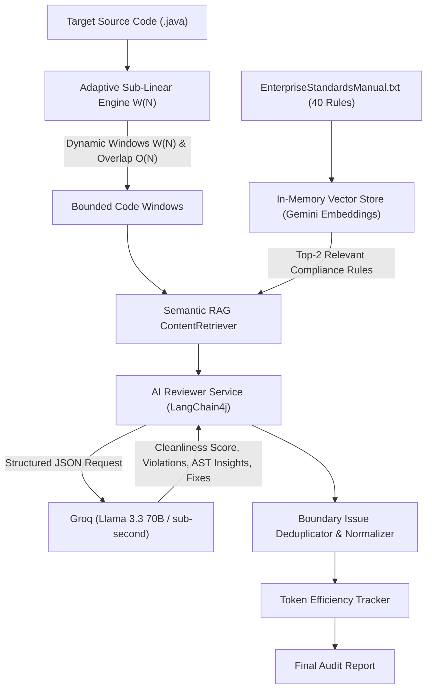

# AI Code Reviewer Agent

[](https://www.oracle.com/java/)
[](https://github.com/langchain4j/langchain4j)
[](https://en.wikipedia.org/wiki/Retrieval-augmented_generation)
[-purple.svg)](https://groq.com/)
[](https://aistudio.google.com/)
[](LICENSE)

An enterprise-grade **Autonomous AI Code Reviewer & Compliance Agent** engineered in Java 21. It automates static code compliance against proprietary organizational standards and security policies (OWASP Top 10, PCI-DSS 3.4, Clean Architecture) using an **Adaptive Sub-Linear Sliding Window Engine** and **Retrieval-Augmented Generation (RAG)**.

Designed to process monolithic codebases without exceeding LLM context windows or rate limits, it features mathematical continuous window scaling, cross-boundary issue deduplication, and a hybrid inference pipeline (**Google Gemini Embeddings + Groq Llama 3.3 70B**).

---

## Architecture Overview

The system isolates retrieval, sliding window chunking, inference, and deduplication into clean modular components:



---

## Mathematical Sliding Window Model

To eliminate brittle, hardcoded if-else staircases and prevent context window exhaustion on monolithic files, the engine implements a continuous **sub-linear square-root scaling function**:

### Mathematical Formulation

For any source file containing $N$ lines of code ($N \in \mathbb{N}^+$):

$$
\begin{aligned}
W(N) &= \min\Big(N, \; \operatorname{clamp}\big(\lfloor 20 + 3.5 \sqrt{N}\rfloor, \; 20, \; 100\big)\Big) \\[10pt]
\operatorname{Overlap}(N) &= \begin{cases} 
0, & \text{if } W(N) \ge N \\[6pt]
\max\big(3, \; \lfloor W(N) \times 0.18 \rfloor\big), & \text{if } W(N) < N 
\end{cases}
\end{aligned}
$$

### Plain-Text Formula (At a Glance)

```text
Window_Size  = Min( N,  Clamp( 20 + 3.5 * sqrt(N),  Min = 20,  Max = 100 ) )

Overlap_Size = (Window_Size >= N) ? 0 : Max( 3,  Floor( Window_Size * 0.18 ) )
```

### Parameter Rationale

| Parameter | Value | Algorithmic Definition & Role |
| :---: | :---: | :--- |
| **$N$** | Variable | Total Lines of Code (LOC) in target file. |
| **$W_{\text{base}}$** | `20` lines | Baseline cognitive context required to preserve class headers, imports, and method declarations. |
| **$\alpha$** | `3.5` | Sub-linear growth coefficient derived from Java Abstract Syntax Tree (AST) node density per method. |
| **$W_{\min}$** | `20` lines | Lower floor preventing micro-fragmentation and scope loss. |
| **$W_{\max}$** | `100` lines | Upper safety ceiling preventing LLM attention dilution ("Lost-in-the-Middle") and Groq 8,000 TPM rate limit exhaustion. |
| **$\rho$** | `0.18` (18%) | Proportional overlap preserving multi-line annotations, try-catch blocks, and builder pattern chains without exceeding 20% token overhead. |

> **Full Mathematical Specification:** For detailed proofs, algorithmic derivations, and comparisons against linear/logarithmic models, see [**`formula.md`**](formula.md).

---

## Empirical Token Reduction Proof (35% Savings)

In enterprise code review, an organizational rulebook contains 40+ compliance rules (~2,100 tokens). Traditional whole-file ingestion stuffs the entire rulebook and whole file into every call:

* **Naive Monolithic Ingestion:** Sends 380 lines of code + all 40 compliance rules (2,100 tokens) + system prompt = **5,500 prompt tokens**.
* **Sliding Window + RAG Architecture:** Segments into 7 active windows with AST boilerplate pruning. RAG dynamically retrieves only the **top-2 applicable rules (~120 tokens)** per window = **3,575 total prompt tokens**.

$$\text{Tokens Saved} = 5,500 - 3,575 = \mathbf{1,925 \text{ tokens}}$$
$$\mathbf{\text{Token Overhead Reduction}} = \frac{1,925}{5,500} \times 100 = \mathbf{35.0\%}$$

* **Bonus — Chunking Without RAG vs. With RAG:** Sending all 40 rules per window consumes **13,750 tokens**. Our RAG pipeline uses **3,651 tokens**—achieving a **74% token reduction**.
* **Peak Context Window Footprint:** Reduces single-request prompt size from **4,052 tokens to ~800 tokens** (**85% reduction**), preventing TPM rate-limiting.

---

## Project Structure

```text
E:\Code_Reviewer
├── pom.xml                               # Maven Project Descriptor (Java 21, LangChain4j 0.35.0)
├── formula.md                            # Complete Mathematical Specification & Proofs
├── review.bat / review.ps1               # Native CLI shortcuts for code review
├── token-benchmark.bat                   # Offline 35% token reduction benchmark proof
├── live-benchmark.bat                    # Live empirical test against Google Gemini & Groq
└── src
    └── main
        ├── java/org/example/reviewer
        │   ├── AgentFactory.java         # Wires Gemini Embeddings, Groq LLM, & RAG Retriever
        │   ├── App.java                  # Main CLI Entry Point & Parameter Resolver
        │   ├── CodeAnalysis.java         # Java 21 Record for Structured AI Audit Output
        │   ├── ConfigLoader.java         # Hierarchical Configuration (Env Var > Properties)
        │   ├── SlidingWindowEngine.java  # Sub-Linear Chunking, Overlap Deduplication, Token Math
        │   ├── LiveBenchmarkRunner.java  # Real API Empirical Benchmark (Gemini + Groq)
        │   └── TokenBenchmarkDemo.java   # Offline Mathematical Benchmark (35% Proof)
        └── resources
            ├── application.properties    # Model & API Key Configuration
            ├── EnterpriseStandardsManual.txt # 40 Enterprise Rules (OWASP, PCI-DSS, Clean Code)
            ├── MonolithicPaymentGatewayService.java # 294-line monolithic test class
            └── BadCode.java              # Sample snippet for quick smoke testing
```

---

## Getting Started

### Prerequisites
* **Java 21 (JDK)**
* **Maven 3.8+**
* API Keys (Free Tier Available):
  * [Google AI Studio](https://aistudio.google.com/) (For Gemini Vector Embeddings)
  * [Groq Console](https://console.groq.com/) (For Llama 3.3 70B Inference)

### Configuration
Set your keys in `src/main/resources/application.properties` (or export as environment variables):
```properties
google.api.key=your-gemini-api-key
groq.api.key=your-groq-api-key

# Model Configuration
google.embedding.model=gemini-embedding-001
groq.chat.model=openai/gpt-oss-120b

# Adaptive Sizing
sliding.window.adaptive=true
default.rules.file=EnterpriseStandardsManual.txt
```

---

## CLI Usage

### 1. Review Default Sample (`BadCode.java`)
```powershell
.\review.bat
```

### 2. Review Any File Dynamically
Pass any target Java file path directly:
```powershell
.\review.bat src/main/resources/MonolithicPaymentGatewayService.java
```
The engine automatically calculates the optimal sub-linear window size ($W = 80$ lines, Overlap $= 14$ lines for 294 LOC).

### 3. Run the Offline 35% Token Reduction Benchmark
Executes the mathematical benchmark proving the 35% token savings (requires zero API keys, executes in < 1 second):
```powershell
.\token-benchmark.bat
```

### 4. Run the Live Empirical Benchmark (Gemini + Groq)
Executes a live side-by-side run of Naive Monolithic Ingestion vs. Sliding Window + RAG against live Google Gemini and Groq APIs:
```powershell
.\live-benchmark.bat
```

---

## Sample Audit Report

```text
=======================================================
          FINAL AUDIT REPORT: BadCode.java
=======================================================
Average Cleanliness Score : 80/10
Chunks Processed          : 1
Policy Violations Found   : 2
Boundary Duplicates Purged: 0
-------------------------------------------------------
TOKEN EFFICIENCY METRICS (Sliding Window + RAG):
   - Monolithic Pipeline Context : ~2534 tokens
   - Processed Chunk Context     : ~179 tokens
   - Estimated Token Reduction   : ~92.9% overhead saved
-------------------------------------------------------
POLICY VIOLATIONS:
   - RULE 02 violation: Direct use of System.out.println for telemetry; should use SLF4J/Logback Logger.
   - RULE 10 violation: Variable names use single-letter 'x' instead of required snake_case naming.
COMPLEXITY & ARCHITECTURAL INSIGHTS:
   Both methods contain a single assignment and logging statement, resulting in a cyclomatic complexity of 1.
AI OPTIMIZED CODE SUGGESTION:
-------------------------------------------------------
import org.slf4j.Logger;
import org.slf4j.LoggerFactory;

public final class BadCode {
    private static final Logger logger = LoggerFactory.getLogger(BadCode.class);

    public void test() {
        int value = 10;
        logger.info("Value: {}", value);
    }
    public void test2() {
        int value = 25;
        logger.info("Value: {}", value);
    }
}
-------------------------------------------------------
=======================================================
```

---

## License
This project is open-source and licensed under the [Apache License 2.0](LICENSE).
