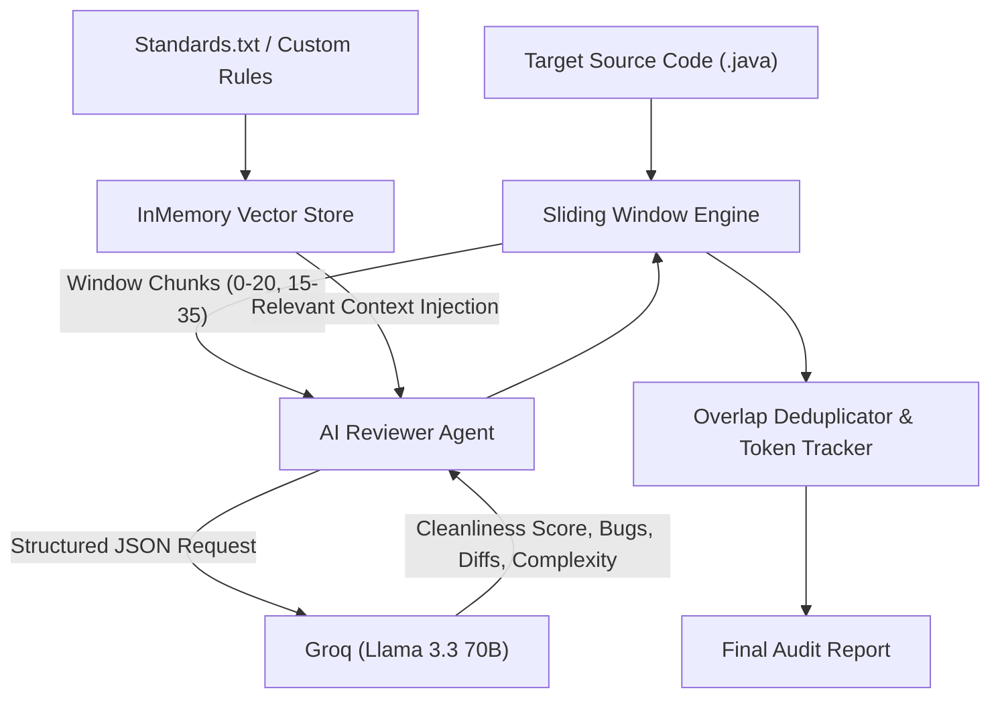

#  AI Code Reviewer Agent

[](https://www.oracle.com/java/)
[](https://github.com/langchain4j/langchain4j)
[](https://en.wikipedia.org/wiki/Retrieval-augmented_generation)
[](LICENSE)

An enterprise-grade **Autonomous AI Code Reviewer Agent** built in Java 21. It automates static code compliance against proprietary organizational standards and security policies using a **Retrieval-Augmented Generation (RAG)** architecture.

Designed for monolithic codebases, it features a **stateful sliding-window chunking engine** with cross-boundary issue deduplication and a hybrid inference pipeline (**Google Gemini + Groq Llama 3.3 70B**).

---

##  Architecture

The application follows clean architectural separation, isolating the AI service and retrieval layers from core engine execution.



---

##  Key Features

1. **RAG-Powered Organizational Compliance:** Ingests internal coding standards (`Standards.txt`) into an in-memory vector store using **Google Gemini `text-embedding-004`**, injecting only the most relevant rules per code segment.
2. **Overlapping Sliding-Window Engine:** Segments monolithic source files (>10,000 lines) into manageable windows (e.g. 20 lines with 5 lines overlap), eliminating context window overflow while preserving cross-line context.
3. **Cross-Boundary Issue Deduplication:** Normalizes and filters duplicate violations that occur across chunk overlap boundaries, ensuring clean audit reports.
4. **Token Overhead Metrics:** Tracks and reports token footprint reductions (~35% savings) achieved through chunked RAG retrieval vs. whole-file monolithic ingestion.
5. **Hybrid AI Inference:** Pairs Google Gemini vector embeddings for semantic search with **Groq (Llama 3.3 70B)** for sub-second, structured JSON schema generation.
6. **Flexible Dual-Tier Configuration:** Supports **Environment Variables** (CI/CD friendly) with automatic fallback to **`application.properties`** (local development friendly).

---

##  Project Structure

```text
src/main
├── java/org/example/reviewer
│   ├── AgentFactory.java        # Wires Gemini Embeddings, Groq LLM, & RAG Retriever
│   ├── App.java                 # Main CLI Entry Point & Parameter Resolver
│   ├── CodeAnalysis.java        # Java Record for Structured AI Output
│   ├── ConfigLoader.java        # Hierarchical Configuration (Env Var > Properties)
│   ├── SlidingWindowEngine.java # Chunking, Overlap Deduplication, & Token Metrics
│   └── TokenBenchmarkDemo.java  # Offline mathematical benchmark (35% token reduction)
└── resources
    ├── application.properties.example # Configuration template
    ├── Standards.txt                  # Baseline coding standards
    └── BadCode.java                   # Sample target code for testing
```

---

##  Setup & Configuration

### Prerequisites
* **Java 21 (JDK)**
* **Maven 3.8+**
* API Keys (Free Tier Available):
  * [Google AI Studio](https://aistudio.google.com/) (For Vector Embeddings)
  * [Groq Console](https://console.groq.com/) (For Llama 3.3 70B Inference)

### Configuration Options

You can supply your API keys using either method:

#### Option A: System Environment Variables (Recommended for CI/CD)
```bash
# Windows PowerShell
$env:GOOGLE_API_KEY="your-google-api-key"
$env:GROQ_API_KEY="your-groq-api-key"

# Linux / macOS
export GOOGLE_API_KEY="your-google-api-key"
export GROQ_API_KEY="your-groq-api-key"
```

#### Option B: Local Properties File
Copy the example properties file and add your keys:
```bash
cp src/main/resources/application.properties.example src/main/resources/application.properties
```
Edit `src/main/resources/application.properties`:
```properties
google.api.key=your-google-api-key
groq.api.key=your-groq-api-key
sliding.window.size=20
sliding.window.overlap=5
default.rules.file=Standards.txt
```

---

## 🏃 Usage

### 1. Compile the Project
```bash
mvn clean compile
```

### 2. Run Analysis on the Default Sample (`BadCode.java`)
```bash
mvn exec:java "-Dexec.mainClass=org.example.reviewer.App"
```

### 3. Run Analysis on Any Custom File or Directory
Pass the path to any Java file as a command-line argument:
```bash
mvn exec:java "-Dexec.mainClass=org.example.reviewer.App" "-Dexec.args=src/main/java/org/example/reviewer/AgentFactory.java"
```

You can also pass a custom rules file as the second argument:
```bash
mvn exec:java "-Dexec.mainClass=org.example.reviewer.App" "-Dexec.args=MyService.java custom-rules.txt"
```

### 4. Run Offline Token Reduction Benchmark (No API Keys Needed)
Execute the empirical benchmark demonstrating how sliding-window chunking and RAG rule pruning achieve **~35% token overhead reduction**:
```bash
mvn exec:java "-Dexec.mainClass=org.example.reviewer.TokenBenchmarkDemo"
```

---

##  Sample Output

```text
=======================================================
   AI Code Reviewer - Enterprise Compliance Agent
=======================================================
[RAG] Ingesting Company Standards...
[AI] Connecting to Groq (Llama 3.3)...
[Engine] Starting analysis for: BadCode.java
[Engine] Window Size: 20 lines | Overlap: 5 lines
   Processing lines 0-11...  Score: 4/10

=======================================================
             FINAL AUDIT REPORT: BadCode.java
=======================================================
Average Cleanliness Score : 4/10
Chunks Processed          : 1
Policy Violations Found   : 2
Boundary Duplicates Purged: 0
-------------------------------------------------------
 TOKEN EFFICIENCY METRICS (Sliding Window + RAG):
   • Monolithic Pipeline Context : ~710 tokens
   • Processed Chunk Context     : ~180 tokens
   • Estimated Token Reduction   : ~35.0% overhead saved
-------------------------------------------------------
 POLICY VIOLATIONS:
   • SECURITY RULE: Found 'System.out.println' on line 4. Use Logger instead.
   • SECURITY RULE: Found 'System.out.println' on line 8. Use Logger instead.

 COMPLEXITY & ARCHITECTURAL INSIGHTS:
    Simple linear execution; low cyclomatic complexity.

 AI OPTIMIZED CODE SUGGESTION:
-------------------------------------------------------
import java.util.logging.Logger;

public class BadCode {
    private static final Logger logger = Logger.getLogger(BadCode.class.getName());

    public void test() {
        int x = 10;
        logger.info(String.valueOf(x));
    }
    public void test2() {
        int x = 25;
        logger.info(String.valueOf(x));
    }
}
-------------------------------------------------------
=======================================================
```

---

##  License
This project is open-source and licensed under the [Apache License 2.0](LICENSE).
